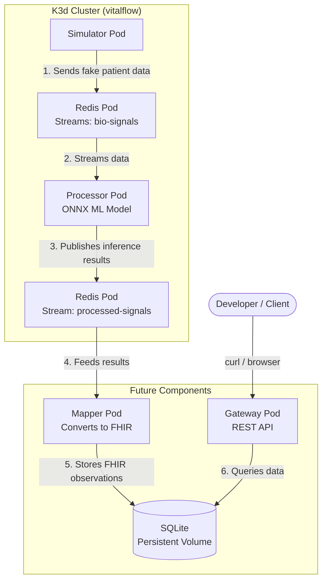

## VitalFlow - Real-Time Anomaly Detection Pipeline

A real-time streaming pipeline that simulates patient breathing data, detects anomalies using an ONNX machine learning model, and stores the results in a structured format.

> **⚠️ DISCLAIMER: All data generated by this project is entirely synthetic and fake. No real patient data is used, collected, or stored.**

## What This Project Does

**The Problem:** In clinical settings, respiratory deterioration (abnormal breathing patterns) can go undetected between manual vital sign checks, potentially leading to delayed intervention.

**The Solution:** This pipeline continuously monitors simulated breathing data in real-time, automatically flags anomalies, and creates structured records for each simulated event.

## How It Works

1. **Simulator** generates synthetic patient data every second:
   - Breathing rate (12-20 bpm normal, with occasional anomalies)
   - 64-dimension audio spectrum features (simulated random data)
   - Patient ID and timestamp
   - **All data is fake and randomly generated**

2. **Redis Streams** acts as the message backbone:
   - `bio-signals` stream holds raw incoming data
   - `processed-signals` stream holds inference results

3. **Processor** runs an ONNX ML model on each data point:
   - Takes the 64 audio features as input
   - Outputs a probability (0-1) of abnormality
   - Publishes results to the output stream

4. **Mapper** converts results to structured format:
   - Creates FHIR Observation resources
   - Stores in SQLite database

5. **Gateway** exposes REST API:
   - Query observations by patient
   - Returns JSON in standard format


## What the ONNX Model Does

The model is a simple neural network (ReduceMean + Sigmoid) that:
- Takes the 64-dimension audio spectrum as input
- Outputs a probability between 0 and 1
- Values > 0.5 are classified as "abnormal"

In a real deployment, this would be replaced with a trained model using actual respiratory audio data.

## Data Flow Example

**Input (simulator to Redis):**
```json
{
  "patient_id": "P42",
  "timestamp": 1744855200.0,
  "breathing_rate": 18.3,
  "audio_spectrum": [0.1, 0.5, ... 64 values],
  "anomaly": false
}
```

## Architecture Diagram

## Quick deploy
# Create K3d cluster
```bash
k3d cluster create vitalflow --servers 1 --agents 0 --k3s-arg "--disable=traefik@server:0"
```
# Deploy the stack
```bash
./deploy.sh
```
## Build Images
```bash
cd simulator && docker build -t simulator:latest . && cd ..
cd processor && docker build -t processor:latest . && cd ..
k3d image import simulator:latest processor:latest --cluster vitalflow
kubectl rollout restart deployment/simulator processor -n vitalflow
```
## View logs
```bash
# Watch simulator generating fake data
kubectl logs -n vitalflow deployment/simulator

# Watch processor detecting anomalies on fake data
kubectl logs -n vitalflow deployment/processor
```

## Check Status
```bash
kubectl get pods -n vitalflow
kubectl get services -n vitalflow
```

## Query result
```bash
# Port forward to gateway
kubectl port-forward -n vitalflow svc/gateway 8000:8000

# Query observations for a patient
curl -H "api-key: test-key-123" "http://localhost:8000/fhir/Observation?patient=P42"
```

## CleanUp
```bash
./cleanup.sh
k3d cluster delete vitalflow
```
